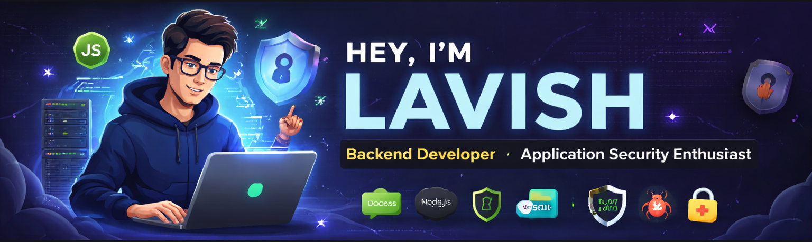

a href="#">

<h1 align="center">Hi , I'm Lavish</h1>
<h3 align="center">Backend Developer | Application Security Enthusiast</h3>

---

## 🙋‍♂️ About Me

- 💻 Backend-focused developer skilled in **Node.js, Express and REST APIs**
- 🔐 Interested in **Application Security (OWASP Top 10, API Security, Secure Coding)**
- 🧠 Strong problem-solving skills in **Data Structures & Algorithms**
- 🌱 Currently learning **AppSec concepts and scalable backend design**
- 🤝 Open to collaboration and learning opportunities

---

## 🛠 Skills

### Languages

### Frontend

### Backend

### Database

### Tools

### 🔐 Application Security

---

## 🔐 Areas of Interest

- Backend Development
- REST API Design
- Application Security
- OWASP Top 10
- Secure Authentication (JWT)
- API Security Best Practices

---

## 🌐 Connect with me

---

## 📊 My Github Stats

 

<table align="center">
<tr>
<td>

</td>

<td width="30"></td>

<td>

</td>
</tr>
</table>

 
